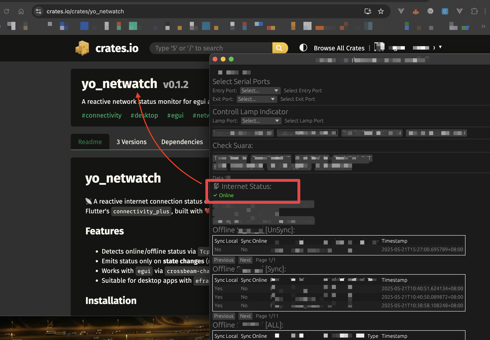

[](https://crates.io/crates/yo_netwatch)

----



# yo_netwatch

📡 A reactive internet connection status checker for `egui` apps — inspired by Flutter's `connectivity_plus`, built with ❤️ in Rust by Yo.

## Features

- Detects online/offline status via `TcpStream` ping
- Emits status only on **state changes** (not polling UI)
- Works with `egui` via `crossbeam-channel`
- Suitable for desktop apps with `eframe`

## Installation

```toml
cargo install yo_netwatch
```

## Short Usage

```rust
use yo_netwatch::start_network_watcher;

let rx = start_network_watcher();
if let Ok(online) = rx.recv() {
    println!("Status jaringan: {}", if online { "Online ✅" } else { "Offline ❌" });
}
```

## Usage

```rust
use eframe::egui;
use yo_netwatch::{start_network_watcher, Receiver};

fn main() -> Result<(), eframe::Error> {
    eframe::run_native(
        "Network Status App",
        eframe::NativeOptions::default(),
        Box::new(|_| Box::new(MyApp::new())),
    )
}

struct MyApp {
    connected: bool,
    rx: Receiver<bool>,
}

impl MyApp {
    fn new() -> Self {
        let rx = start_network_watcher();
        Self {
            connected: false,
            rx,
        }
    }
}

impl eframe::App for MyApp {
    fn update(&mut self, ctx: &egui::Context, _: &mut eframe::Frame) {
        while let Ok(status) = self.rx.try_recv() {
            self.connected = status;
        }

        egui::CentralPanel::default().show(ctx, |ui| {
            ui.heading("📡 Internet Status:");
            ui.label(if self.connected {
                "✅ Online"
            } else {
                "❌ Offline"
            });
        });

        ctx.request_repaint_after(std::time::Duration::from_millis(100));
    }
}
```

## License
